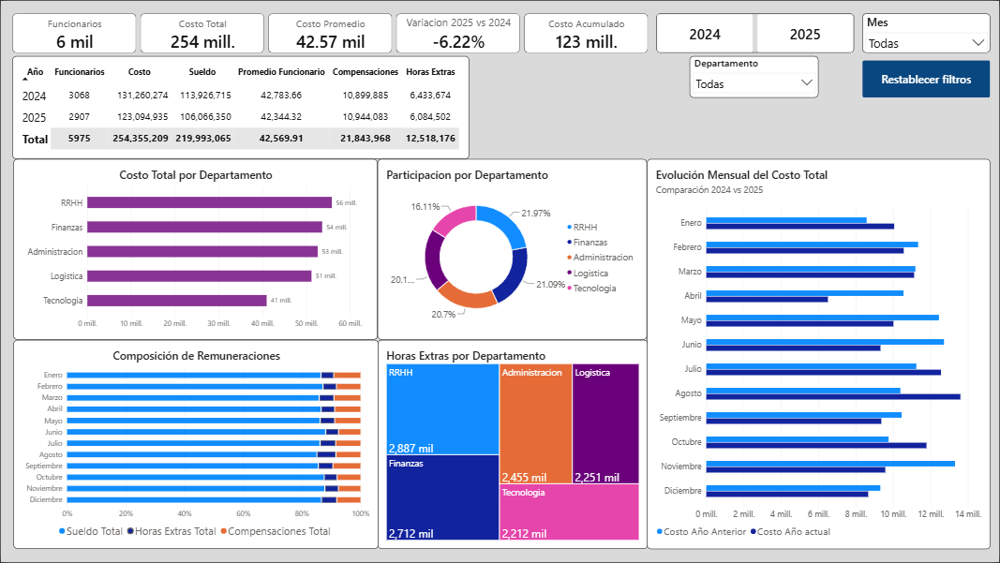
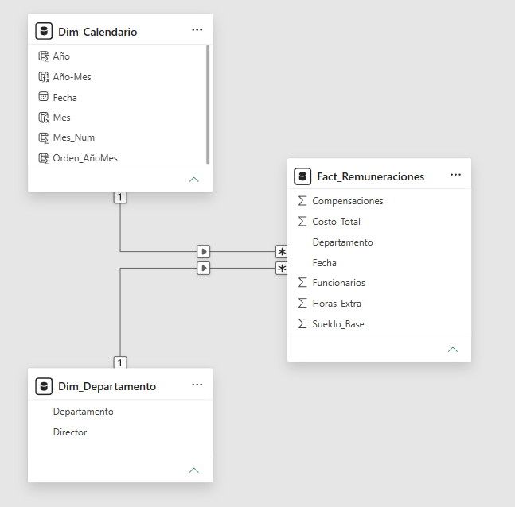

Dashboard de Remuneraciones | Power BI

Dashboard interactivo desarrollado en **Power BI** para analizar costos de personal y remuneraciones, utilizando un modelo de datos tipo *Star Schema*, medidas en *DAX* y procesos de transformación con *Power Query*.

El proyecto permite analizar la evolución de los costos, la composición de las remuneraciones y la distribución de los gastos por departamento.

Tecnologías utilizadas

* Power BI Desktop
* Power Query
* DAX
* Microsoft Excel

Indicadores principales

* Total de Funcionarios
* Costo Total
* Costo Promedio por Funcionario
* Variación Interanual
* Costo Acumulado (YTD)

Funcionalidades implementadas

* Modelo de datos tipo **Star Schema**
* Comparación interanual (2025 vs 2024)
* KPIs dinámicos
* Segmentadores interactivos
* Análisis por Departamento
* Evolución mensual de costos
* Análisis de Sueldos, Horas Extras y Compensaciones
* Participación por Departamento
* Botón para restablecer filtros

Dashboard

---

Modelo de Datos

Objetivo del proyecto

Este proyecto fue desarrollado como parte de mi portfolio de **Data Analytics**, aplicando buenas prácticas de modelado de datos, construcción de medidas DAX y diseño de dashboards orientados al análisis de información y apoyo a la toma de decisiones.

Autor

*Sebastián de Medina*

Proyecto desarrollado como parte de mi portfolio profesional de Data Analytics.
